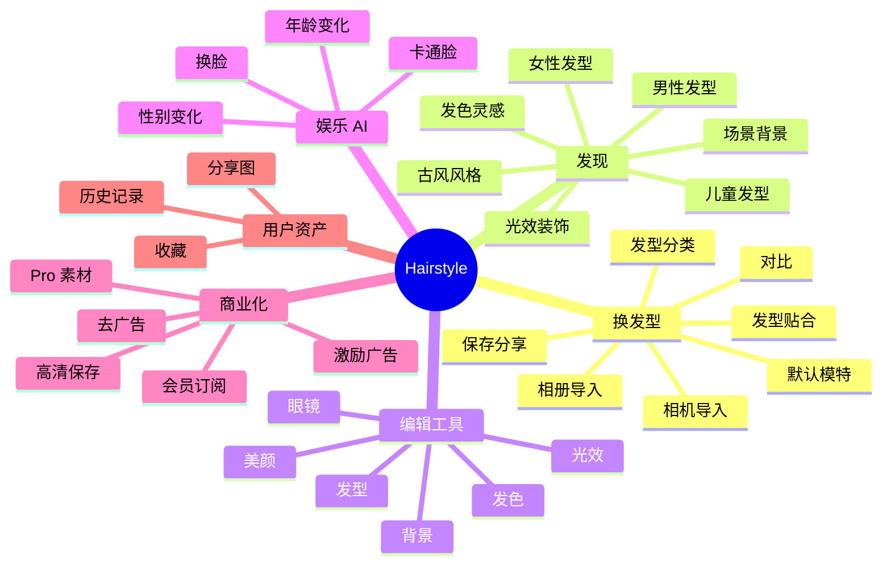
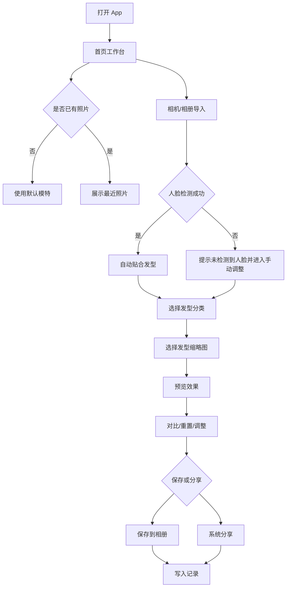
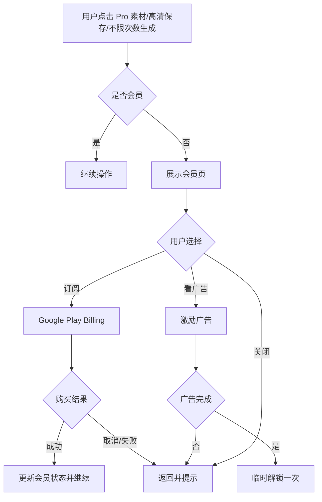

# Hairstyle / AI 换发型 产品需求文档 PRD

版本：v1.0  
日期：2026-04-28  
产物路径：`docs/hairstyle-product-prd.md`  
依据 APK：`/Users/all/Library/Containers/com.tencent.xinWeChat/Data/Documents/xwechat_files/wxid_2346403465512_146a/msg/file/2025-12/Hairstyle Try On-600+ Haircuts_189.0.0_APKPure.zip`  
包名：`com.hair_flutter`  
应用名：`Hairstyle`  
APK 版本：`189.0.0` / versionCode `189`  
平台：Android，minSdk 23，targetSdk 35

## 0. 文档说明

### 0.1 目标

本文档用于基于 APK 静态分析结果，反向梳理原产品的完整 PRD，并作为后续 Flutter 复刻、UI 重构、功能拆解、开发排期和验收测试的基础文档。

### 0.2 证据等级

| 等级 | 含义 | 示例 |
|---|---|---|
| A：APK 直接证据 | 从 manifest、资源目录、`hairs.json`、二进制字符串、权限和 SDK 直接获得 | 包名、权限、素材数量、订阅 SKU 线索、本地资源目录 |
| B：功能强推断 | 由资源命名、页面图标、权限、SDK 和字符串共同指向 | 换发型、发色、眼镜、年龄变化、性别变化、保存、分享、会员 |
| C：产品设计补全 | 为复刻和开发落地而补齐的体验、状态、埋点和验收要求 | 首页导航、历史记录、分层会员权益、异常兜底 |

### 0.3 当前边界

- 本 PRD 基于 APK 静态拆解与既有本地资源分析，不等同于原应用服务端接口文档。
- 原 APK 中部分 AI 能力可能依赖远程服务，本文档以“功能表现”和“复刻落地方案”描述，不假设现有云端接口一定可用。
- 会员、广告、评分、隐私合规按照 APK 中 SDK 与权限线索还原，并补充开发必要规则。

## 1. APK 证据摘要

### 1.1 安装包信息

| 项目 | 结果 |
|---|---|
| 安装包形态 | XAPK，包含主 APK、语言 split、hdpi split、armeabi-v7a split |
| 主 APK | `com.hair_flutter.apk`，约 83 MB |
| XAPK 总大小 | 104,037,070 bytes，约 99 MB |
| 包名 | `com.hair_flutter` |
| 应用名 | `Hairstyle` |
| 版本 | `189.0.0` |
| versionCode | `189` |
| minSdk | 23 |
| targetSdk | 35 |

### 1.2 权限与能力

| 权限 | 产品含义 |
|---|---|
| `android.permission.CAMERA` | 支持拍照导入人像 |
| `android.permission.INTERNET` | 支持广告、远程素材、统计、可能的 AI 云端处理 |
| `android.permission.ACCESS_NETWORK_STATE` | 判断网络状态，控制广告/远程请求 |
| `com.android.vending.BILLING` | Google Play 订阅/内购 |
| `com.android.vending.CHECK_LICENSE` | 授权校验 |
| `com.google.android.gms.permission.AD_ID` | 广告 ID、投放归因、广告个性化 |
| `android.permission.ACCESS_ADSERVICES_*` | Android 新广告隐私沙盒相关能力 |
| `android.permission.WAKE_LOCK` | 后台任务、SDK 或长耗时处理防休眠 |
| `android.permission.FOREGROUND_SERVICE` | SDK 或后台任务支持 |
| `BIND_GET_INSTALL_REFERRER_SERVICE` | 安装归因 |

### 1.3 SDK 与商业化线索

| 类型 | 证据 | 产品含义 |
|---|---|---|
| 广告 | AdMob App ID：`ca-app-pub-1992735256311200~2565281874` | 原产品接入 Google 广告 |
| 广告/社交 | Facebook SDK metadata | 可能用于广告、归因、登录或分享生态 |
| 统计 | Firebase Core / Analytics | 事件统计、留存、转化分析 |
| 内购 | Google Play Billing / IAP 字符串 | 会员订阅、权益解锁 |
| 分享 | `share_plus` provider/receiver | 系统分享图片 |
| 图片输入 | Image Picker 字符串、相册/相机文案 | 相机/相册导入 |
| 保存 | Image Gallery Saver 相关字符串 | 保存合成结果到相册 |
| 外链 | URL Launcher、WebView、Custom Tabs | 隐私政策、条款、评分、订阅说明 |

### 1.4 本地资源规模

| 资源目录 | 数量 | 推断用途 |
|---|---:|---|
| `assets/glasses/hair*.png` | 575 | 发型叠加素材 |
| `assets/glasses/glass*.png` | 146 | 眼镜叠加素材 |
| `assets/female` | 40 | 女性发型/模板素材 |
| `assets/male` | 28 | 男性发型/模板素材 |
| `assets/child` | 27 | 儿童发型/年龄相关模板 |
| `assets/ancient` | 24 | 古风/主题风格模板 |
| `assets/color` | 21 | 发色/色彩 mood 素材 |
| `assets/scene` | 37 | 背景场景 |
| `assets/lines` | 17 | 光效/线条装饰 |
| `assets/ages` | 12 | 年龄变化相关素材 |
| `assets/icon` | 57 | 功能图标、背景图、VIP 图标 |
| `assets/data/hairs.json` | 1 | 发型元数据 |

### 1.5 `hairs.json` 数据结构

总记录数：575。

字段：

| 字段 | 类型 | 含义 |
|---|---|---|
| `hairstyleId` | number | 发型 ID |
| `gender` | number | 性别分类，原包中存在 1/2 两类 |
| `type` | number | 发型长度或类别，原包中存在 1/2/3 三类 |
| `materialUrl` | string | 发型透明素材远程 URL |
| `modelUrl` | string | 模特预览图远程 URL |
| `a` / `b` | stringified array | 贴合关键点或参考坐标 |
| `stretch` | number | 拉伸配置 |
| `adjust` | number | 调整配置 |
| `status` | number | 状态字段 |
| `createTime` | string | 创建时间 |

数据分布：

| 维度 | 数量 |
|---|---:|
| `gender=1` | 379 |
| `gender=2` | 196 |
| `type=1` | 393 |
| `type=2` | 103 |
| `type=3` | 79 |
| `gender=1/type=1` | 236 |
| `gender=1/type=2` | 72 |
| `gender=1/type=3` | 71 |
| `gender=2/type=1` | 157 |
| `gender=2/type=2` | 31 |
| `gender=2/type=3` | 8 |

### 1.6 功能字符串与资源命名线索

APK 字符串和资源名出现以下能力：

- `SegmentHair`、`localAI`：发型分割/本地 AI 相关线索。
- `gallery`、`album`、`Camera`：相册和相机输入。
- `saveScreen`、`sex_save`、`age_save`：保存功能。
- `Share`、`SharePlus`：分享功能。
- `purchaseSuc`、`hair_yearly`、`per year`：订阅购买成功、年订阅 SKU。
- `rateBtn`、`We'd greatly appreciate if you can rate us`：评分弹窗。
- `sex_camera`、`sex_male`、`sex_female`、`sex_compare`：性别变化功能。
- `age_camera`、`age_compare`、`age_arrow`：年龄变化功能。
- `beauty_compare`、`beauty*`：美颜/妆容增强。
- `swap_bg`：换脸相关页面。
- `color_unsel`：发色分类或选择态。
- `vip.png`、`pro.png`、`crown.png`：会员权益。

## 2. 产品定位

Hairstyle 是一款面向泛女性用户和自拍用户的 AI 妆发试戴工具。核心价值是让用户在不剪发、不染发、不化妆的前提下，通过上传人像或使用默认模特，快速预览不同发型、发色、眼镜和形象变化效果，并保存或分享结果。

产品关键词：AI 换发型、发型试戴、发色预览、眼镜试戴、妆容增强、年龄变化、性别变化、换脸娱乐、头像生成、轻量编辑、订阅变现。

### 2.1 一句话产品定义

为女性用户提供“上传照片 -> 选择风格 -> AI 预览 -> 对比保存”的时尚妆发试用工具。

### 2.2 竞争优势方向

| 方向 | 说明 |
|---|---|
| 丰富素材 | APK 内置 575 个发型叠加素材、146 个眼镜素材和多类模板 |
| 上手快 | 默认模特 + 相机/相册导入，降低首次使用门槛 |
| 轻娱乐 + 实用 | 同时满足发型决策、头像生成和娱乐变脸 |
| 商业化直接 | 订阅、广告、评分转化链路完整 |
| 多语言覆盖 | split APK 包含多语言资源，具备国际化投放基础 |

## 3. 目标用户与场景

### 3.1 核心用户

| 用户 | 特征 | 需求 |
|---|---|---|
| 换发决策用户 | 18-35 岁女性，准备剪发/染发 | 先看效果，降低试错成本 |
| 美妆自拍用户 | 喜欢自拍、头像、社媒分享 | 快速生成更漂亮、更时尚的人像图 |
| 潮流内容用户 | 关注短视频、社交平台、发型趋势 | 找灵感、做对比、分享结果 |
| 轻娱乐用户 | 对年龄变化、性别变化、卡通脸感兴趣 | 好玩、快速出图、可分享 |

### 3.2 次级用户

| 用户 | 场景 |
|---|---|
| 男性用户 | 试短发、商务发型、胡须/眼镜搭配，APK 中有 male 资源 |
| 家长 | 儿童发型预览，APK 中有 child 资源 |
| 古风/主题用户 | 古风发型、主题头像，APK 中有 ancient 资源 |

### 3.3 用户痛点

- 去理发店前无法判断发型是否适合自己的脸型。
- 染发、剪刘海、剪短发的试错成本高。
- 普通修图 App 不聚焦发型，操作复杂。
- 想要社媒头像和妆发灵感，但不想学习专业编辑工具。
- 生成后希望快速对比原图并保存分享。

## 4. 产品目标

### 4.1 用户目标

- 3 步内完成一次发型预览：导入照片、选择发型、保存/分享。
- 让用户能快速在“推荐、长发、中长发、短发、刘海、潮色”等维度筛选。
- 支持对比原图与效果图，增强结果可信度。
- 支持默认模特体验，用户不授权相册/相机也能理解产品价值。

### 4.2 业务目标

| 指标 | 目标 |
|---|---|
| 首次生成转化率 | 新用户进入后完成一次预览 |
| 保存率 | 完成试戴后保存到相册 |
| 分享率 | 结果图通过系统分享外发 |
| 订阅转化 | 高清保存、无限生成、去广告、Pro 素材引导订阅 |
| 广告收益 | 非会员用户通过插屏/激励广告变现 |
| 留存 | 历史记录、收藏和发现内容流带动复访 |

### 4.3 体验目标

- 整体视觉风格偏女性、美妆、时尚、柔和高级。
- 画布突出人像，操作按钮不遮挡面部。
- 发型缩略图横向浏览，选择状态明确。
- 关键按钮使用紫色/粉紫渐变，保持统一品牌识别。
- 长文案和多语言文案必须自动换行，不允许溢出。

## 5. 范围定义

### 5.1 P0 MVP 范围

| 模块 | 范围 |
|---|---|
| 首页/工作台 | 标题、会员入口、人像卡、分类、发型列表、生成 CTA、底部导航 |
| 图片输入 | 相机、相册、默认模特 |
| 发型试戴 | 读取 575 发型元数据，分类筛选，选择预览，基础贴合 |
| 编辑画布 | 对比、重置、保存、基础拖拽/缩放/旋转 |
| 保存/分享 | 保存到相册，系统分享 |
| 会员入口 | 订阅页 UI、权益展示、恢复购买入口 |
| 基础记录 | 最近生成结果列表 |
| 权限与异常 | 相机/相册授权、无脸检测、保存失败、网络失败 |

### 5.2 P1 范围

| 模块 | 范围 |
|---|---|
| 发色 | 21 个发色 mood，强度调节 |
| 眼镜 | 146 个眼镜素材，贴合与手动编辑 |
| 发现页 | 女生、男生、儿童、古风、发色、场景等内容流 |
| 年龄变化 | 年龄模板入口、对比、保存 |
| 性别变化 | 男/女风格转换入口、对比、保存 |
| 美颜/妆容 | 美颜增强入口和基础预览 |
| 广告 | 激励广告/插屏广告策略 |
| 评分 | 使用后评分提示 |

### 5.3 P2 范围

| 模块 | 范围 |
|---|---|
| 换脸 | 模板换脸入口和结果页 |
| 卡通脸 | 卡通风格生成入口和结果页 |
| 背景/光效 | 37 场景、17 光效叠加 |
| 收藏 | 收藏发型、发色、模板 |
| 多语言 | 重点市场语言补齐和排版适配 |
| 高级导出 | 高清图、水印控制、前后对比拼图 |

### 5.4 非目标

- 不做专业级 Photoshop 图层系统。
- 不做理发店预约、电商购买、线下导流。
- 不在 MVP 中实现复杂社交关系链。
- 不承诺完全复刻原包所有服务端 AI 效果，除非确认可用接口或替代模型。

## 6. 信息架构

### 6.1 一级导航

| Tab | 名称 | 目标 | 核心内容 |
|---|---|---|---|
| Tab 1 | 换发型 | 完成主任务 | 人像画布、发型分类、发型列表、生成 CTA |
| Tab 2 | 发现 | 承载更多内容和灵感 | 女生/男生/儿童/古风/发色/场景/热门模板 |
| Tab 3 | 记录 | 找回结果、提升复访 | 最近生成、收藏、草稿、重新编辑 |
| Tab 4 | 我的 | 商业化和设置 | 会员、恢复购买、语言、隐私、反馈、评分 |

### 6.2 功能树



## 7. 页面地图

### 7.1 页面清单

| 页面 ID | 页面 | 优先级 | 入口 | 说明 |
|---|---|---|---|---|
| P-01 | 启动页/初始化 | P0 | App 启动 | 初始化资源、订阅、广告、统计 |
| P-02 | 首页/换发型工作台 | P0 | 默认首页 | 主画布、发型选择、生成 CTA |
| P-03 | 相机页 | P0 | 首页、各功能页 | 拍照输入 |
| P-04 | 相册选择 | P0 | 首页、各功能页 | 选择本地人像 |
| P-05 | 编辑器页 | P0 | 选择照片/模板后 | 发型、眼镜、发色、背景编辑 |
| P-06 | 结果预览页 | P0 | 生成后 | 对比、保存、分享 |
| P-07 | 会员页 | P0 | 首页、付费拦截、我的 | 订阅购买和权益展示 |
| P-08 | 发现页 | P1 | 底部导航 | 内容流和分类专题 |
| P-09 | 分类列表页 | P1 | 发现页 | 女生/男生/儿童/古风/发色/场景等 |
| P-10 | 年龄变化页 | P1 | 首页/发现 | 年龄效果生成 |
| P-11 | 性别变化页 | P1 | 首页/发现 | 男/女效果生成 |
| P-12 | 美颜页 | P1 | 首页/发现/编辑器 | 美颜/妆容增强 |
| P-13 | 换脸页 | P2 | 发现页 | 模板换脸 |
| P-14 | 卡通脸页 | P2 | 发现页 | 卡通头像 |
| P-15 | 记录页 | P1 | 底部导航 | 最近生成、收藏、重新编辑 |
| P-16 | 我的页 | P0 | 底部导航 | 会员、设置、隐私、评分 |
| P-17 | 设置页 | P1 | 我的 | 语言、清缓存、隐私条款 |

### 7.2 首页布局要求

| 区域 | 内容 | 规则 |
|---|---|---|
| 顶部品牌区 | 标题 `AI 换发型`，副标题 `发现更美的自己`，会员入口 | 顶部留白适配状态栏，会员入口靠右 |
| 人像主卡 | 当前模特/用户照片，浮层按钮：对比、保存、重置 | 圆角大卡，人物完整展示，避免裁头 |
| 分类胶囊 | 推荐、长发、中长发、短发、刘海、潮色 | 横向滚动，选中态紫色渐变 |
| 发型缩略图 | 原图 + 发型卡片 | 横向滚动，选中卡有描边和勾选标识 |
| 主 CTA | `生成发型`，副文案 `消耗 1 张会员卡` 或免费状态 | 大面积紫粉渐变，固定在底部导航上方或首屏可见 |
| 底部导航 | 换发型、发现、记录、我的 | 图标 + 文案，当前 Tab 高亮 |

## 8. 核心用户流程

### 8.1 换发型主流程



### 8.2 付费拦截流程



### 8.3 保存分享流程

1. 用户点击保存。
2. App 合成当前画布为图片。
3. 判断是否会员/是否高清保存。
4. 非会员按策略加入水印、降清晰度或触发广告/订阅页。
5. 请求相册写入能力并保存。
6. 保存成功提示，并写入历史记录。
7. 用户可继续点击分享，调用系统分享面板。

## 9. 功能需求

### FR-01 启动与初始化

| 项目 | 内容 |
|---|---|
| 优先级 | P0 |
| 证据等级 | B |
| 需求 | App 启动时初始化本地素材索引、订阅状态、广告 SDK、统计 SDK、语言环境 |
| 规则 | 首次启动进入首页；初始化失败不能阻塞默认模特体验；广告失败不能影响主流程 |
| 验收 | 断网时首页仍可打开并展示本地默认内容；初始化错误有日志但不闪退 |

### FR-02 首页/换发型工作台

| 项目 | 内容 |
|---|---|
| 优先级 | P0 |
| 证据等级 | C，结合 APK 功能与用户指定参考 UI |
| 需求 | 首页作为核心工作台，展示人像、分类、发型列表和生成按钮 |
| UI | 浅色背景、紫色渐变、圆角人像卡、悬浮操作按钮、横向胶囊筛选、底部导航 |
| 交互 | 点击发型缩略图立即选中；点击生成执行合成/生成；点击会员进入会员页 |
| 验收 | 常见 390x844、412x915、480x960 屏幕均不溢出；人物头部不被裁切；CTA 首屏可见 |

### FR-03 图片输入

| 项目 | 内容 |
|---|---|
| 优先级 | P0 |
| 证据等级 | A |
| 需求 | 支持相机拍照、相册选择和默认模特体验 |
| 异常 | 用户拒绝权限、取消选择、图片格式不支持、图片过大 |
| 验收 | 拒绝权限后提供说明和再次授权入口；取消选择不报错；大图自动压缩 |

### FR-04 人脸检测与素材贴合

| 项目 | 内容 |
|---|---|
| 优先级 | P0 |
| 证据等级 | B |
| 需求 | 识别人脸位置并将发型/眼镜自动对齐到头部/眼部区域 |
| 规则 | 使用 `hairs.json` 中 `a`、`b`、`stretch`、`adjust` 作为发型贴合参考；检测失败进入手动模式 |
| 验收 | 正脸照片首选发型能覆盖头顶和两侧头发区域；无脸照片可手动拖拽调整 |

### FR-05 发型素材与分类

| 项目 | 内容 |
|---|---|
| 优先级 | P0 |
| 证据等级 | A |
| 需求 | 加载 575 个发型素材，并按性别、长度/类型、推荐状态筛选 |
| 分类建议 | 推荐、长发、中长发、短发、刘海、潮色、男士、儿童、古风 |
| 状态 | 普通、选中、Pro、加载失败 |
| 验收 | 575 条元数据可解析；缩略图列表可横向滚动；素材缺失时显示占位不崩溃 |

### FR-06 发型编辑

| 项目 | 内容 |
|---|---|
| 优先级 | P0 |
| 证据等级 | B |
| 需求 | 支持选中发型后的拖拽、缩放、旋转、翻转、重置、清除 |
| 规则 | 默认自动贴合；用户手动调整后保留调整参数；切换发型时可沿用上一发型变换或重新贴合 |
| 验收 | 双指缩放流畅；重置恢复自动贴合；清除后显示原图 |

### FR-07 对比

| 项目 | 内容 |
|---|---|
| 优先级 | P0 |
| 证据等级 | A/B，资源和字符串出现 compare |
| 需求 | 支持原图和效果图对比 |
| 交互 | 点击或长按对比按钮显示原图；松开/再次点击恢复效果图；可扩展左右滑杆对比 |
| 验收 | 对比状态切换无明显闪烁；按钮不遮挡面部核心区域 |

### FR-08 保存与分享

| 项目 | 内容 |
|---|---|
| 优先级 | P0 |
| 证据等级 | A |
| 需求 | 保存合成结果到系统相册，支持系统分享 |
| 规则 | 保存前按会员状态判断清晰度、水印和次数；保存成功写入记录 |
| 验收 | Android 相册可找到输出图；分享面板可打开；保存失败给出原因 |

### FR-09 发色

| 项目 | 内容 |
|---|---|
| 优先级 | P1 |
| 证据等级 | A/B |
| 需求 | 提供 21 个发色 mood/模板，支持发色预览和强度调节 |
| 交互 | 横向色卡/模板列表；滑杆调整强度；支持清除 |
| 验收 | 选择发色后画布可见变化；强度为 0 时等同原图 |

### FR-10 眼镜试戴

| 项目 | 内容 |
|---|---|
| 优先级 | P1 |
| 证据等级 | A |
| 需求 | 加载 146 个眼镜素材并支持眼镜试戴 |
| 规则 | 眼镜与发型可叠加；眼镜层位于发型层和人像层之间或之上，按素材视觉调整 |
| 验收 | 切换眼镜不影响发型；清除眼镜不清除发型 |

### FR-11 年龄变化

| 项目 | 内容 |
|---|---|
| 优先级 | P1 |
| 证据等级 | A/B |
| 需求 | 提供年龄变化入口，支持导入照片、生成、对比、保存 |
| UI | 独立功能页，延续首页紫白渐变风格 |
| 验收 | 年龄页面入口可达；至少支持默认素材预览；生成失败有提示 |

### FR-12 性别/形象变化

| 项目 | 内容 |
|---|---|
| 优先级 | P1 |
| 证据等级 | A/B |
| 需求 | 提供男性/女性形象变化入口，支持相机、相册、对比、保存 |
| 规则 | 可使用男/女模板资源作为效果预览；真实 AI 转换需接口或模型支持 |
| 验收 | 用户能选择目标性别效果；保存结果可在记录页查看 |

### FR-13 美颜/妆容增强

| 项目 | 内容 |
|---|---|
| 优先级 | P1 |
| 证据等级 | B |
| 需求 | 提供美颜增强入口，支持磨皮、亮肤、瘦脸、眼部、唇色或妆容模板等效果 |
| 规则 | MVP 可先实现效果模板预览；后续接入真实图像处理 |
| 验收 | 分类 Tab 有选中态；效果图和原图可对比 |

### FR-14 换脸与卡通脸

| 项目 | 内容 |
|---|---|
| 优先级 | P2 |
| 证据等级 | B |
| 需求 | 提供换脸和卡通脸入口，用户选择模板后生成效果 |
| 规则 | 需要 AI 服务或本地模型；MVP 阶段可作为可点击功能入口与占位流程 |
| 验收 | 入口存在；未接入服务时说明清楚，不假装生成成功 |

### FR-15 背景与光效

| 项目 | 内容 |
|---|---|
| 优先级 | P2 |
| 证据等级 | A |
| 需求 | 支持 37 个背景场景和 17 个光效/线条叠加 |
| 规则 | 背景层位于人像底层；光效层可在顶层但透明度受控 |
| 验收 | 切换背景不影响发型/眼镜位置；光效不遮挡面部主体 |

### FR-16 发现页信息流

| 项目 | 内容 |
|---|---|
| 优先级 | P1 |
| 证据等级 | C |
| 需求 | 承载更多模板、分类和灵感内容，减少首页拥挤 |
| 内容 | 热门女性发型、专业造型、发色 mood、古风、儿童、男士、场景背景、AI 娱乐功能 |
| 验收 | 至少展示 6 个内容区；卡片点击可进入对应列表或功能页 |

### FR-17 记录与收藏

| 项目 | 内容 |
|---|---|
| 优先级 | P1 |
| 证据等级 | C |
| 需求 | 保存最近生成结果、收藏发型/模板，支持重新编辑 |
| 数据 | 本地存储缩略图路径、原图路径、效果参数、时间、功能类型 |
| 验收 | 保存后记录页出现缩略图；点击记录可预览或重新编辑 |

### FR-18 会员与订阅

| 项目 | 内容 |
|---|---|
| 优先级 | P0 |
| 证据等级 | A |
| 需求 | 支持 Google Play Billing 订阅，至少包含年订阅 SKU 线索 `hair_yearly` |
| 权益建议 | 高清保存、无限生成、去广告、Pro 发型/模板、批量历史、无水印 |
| 状态 | 未订阅、订阅中、购买中、购买成功、购买失败、恢复成功、恢复无订单 |
| 验收 | 购买成功后权益即时生效；失败/取消/恢复无订单都有提示；会员页有条款与隐私入口 |

### FR-19 广告

| 项目 | 内容 |
|---|---|
| 优先级 | P1 |
| 证据等级 | A |
| 需求 | 非会员场景接入广告变现 |
| 广告位建议 | 首页信息流原生广告、保存后插屏、Pro 功能激励广告、启动后延迟加载 |
| 规则 | 广告失败不能阻塞核心流程；频控必须避免打断首次生成 |
| 验收 | 广告加载失败时流程继续；激励广告看完可临时解锁一次权益 |

### FR-20 评分与反馈

| 项目 | 内容 |
|---|---|
| 优先级 | P1 |
| 证据等级 | A |
| 需求 | 在用户完成保存或多次使用后展示评分引导 |
| 规则 | 满足正向时机再弹出；用户拒绝后短期不重复弹 |
| 验收 | 评分按钮可跳转商店；频控有效 |

### FR-21 多语言

| 项目 | 内容 |
|---|---|
| 优先级 | P2 |
| 证据等级 | A |
| 需求 | 支持多语言资源和 RTL/长文案适配 |
| 语言建议 | 英语、中文、日语、韩语、西班牙语、法语、德语、葡萄牙语、俄语、泰语、阿拉伯语、土耳其语、越南语、印地语、意大利语、印尼语 |
| 验收 | 长语言不溢出；阿拉伯语等 RTL 不破坏布局 |

## 10. 编辑器规格

### 10.1 图层模型

从底到顶建议如下：

| 层级 | 内容 | 说明 |
|---|---|---|
| L0 | 背景色/背景图 | 默认浅灰或场景背景 |
| L1 | 用户原图/模特图 | 主体人像 |
| L2 | 发型素材 | 透明 PNG，跟随头部贴合 |
| L3 | 眼镜素材 | 透明 PNG，跟随眼部贴合 |
| L4 | 发色/滤镜效果 | 可作为 mask、blend 或 overlay |
| L5 | 光效/线条 | 装饰层，透明度受控 |
| L6 | 操作浮层 | 对比、保存、重置等按钮，不参与导出或按规则参与水印 |

### 10.2 手势规则

| 手势 | 行为 |
|---|---|
| 单指拖拽 | 移动当前选中素材 |
| 双指缩放 | 缩放当前素材或画布 |
| 双指旋转 | 旋转当前素材 |
| 双击素材 | 重置当前素材到自动贴合位置 |
| 长按对比 | 临时显示原图 |
| 点击空白 | 取消素材选中态 |

### 10.3 状态机

| 状态 | 说明 | 下一步 |
|---|---|---|
| `idle` | 首页默认状态 | 导入照片/选择模板 |
| `loading_image` | 加载图片 | 检测人脸 |
| `detecting_face` | 检测人脸 | 自动贴合/手动模式 |
| `editing` | 编辑中 | 选择素材/调整/对比 |
| `generating` | 生成中 | 结果预览/错误 |
| `saving` | 保存中 | 成功/失败 |
| `paywall` | 付费拦截 | 订阅/广告/关闭 |
| `error` | 错误状态 | 重试/返回 |

## 11. 数据结构建议

### 11.1 发型模型

```json
{
  "hairstyleId": 4,
  "gender": 1,
  "type": 2,
  "materialUrl": "http://...png",
  "modelUrl": "http://...jpg",
  "localMaterialPath": "assets/glasses/hair4.png",
  "localThumbPath": "assets/female/example.png",
  "a": ["25", "52.75"],
  "b": ["71.5", "52.75"],
  "stretch": 1,
  "adjust": 0,
  "status": 0,
  "isPro": false
}
```

### 11.2 编辑会话模型

```json
{
  "sessionId": "uuid",
  "sourceImagePath": "local/path.jpg",
  "selectedHairId": 4,
  "selectedGlassesId": null,
  "selectedColorId": null,
  "selectedSceneId": null,
  "transforms": {
    "hair": {"x": 0, "y": 0, "scale": 1.0, "rotation": 0, "flipX": false},
    "glasses": {"x": 0, "y": 0, "scale": 1.0, "rotation": 0, "flipX": false}
  },
  "createdAt": "2026-04-28T00:00:00Z"
}
```

### 11.3 历史记录模型

```json
{
  "recordId": "uuid",
  "feature": "hair",
  "thumbnailPath": "local/thumb.jpg",
  "resultImagePath": "local/result.jpg",
  "sourceImagePath": "local/source.jpg",
  "assetIds": [4],
  "isFavorite": false,
  "createdAt": "2026-04-28T00:00:00Z"
}
```

### 11.4 会员状态模型

```json
{
  "isSubscriber": false,
  "plan": null,
  "expireAt": null,
  "entitlements": ["standard_export"],
  "remainingFreeGenerations": 3,
  "adUnlockTokens": 0
}
```

## 12. 商业化策略

### 12.1 会员权益

| 权益 | 免费用户 | 会员用户 |
|---|---|---|
| 基础发型试戴 | 有次数限制 | 不限次数 |
| Pro 发型/模板 | 需看广告或订阅 | 全部解锁 |
| 高清保存 | 标清或带水印 | 高清无水印 |
| 广告 | 展示广告 | 去广告 |
| 历史记录 | 最近少量 | 更多记录/收藏 |
| AI 娱乐功能 | 限次 | 不限或更高额度 |

### 12.2 付费触发点

| 场景 | 策略 |
|---|---|
| 点击 Pro 发型 | 弹会员页，允许激励广告解锁一次 |
| 免费生成次数耗尽 | 弹会员页或激励广告 |
| 高清保存 | 弹会员页 |
| 去水印 | 弹会员页 |
| 换脸/卡通等高成本功能 | 会员或消耗会员卡 |

### 12.3 广告频控

| 广告类型 | 展示时机 | 频控 |
|---|---|---|
| 插屏 | 保存成功后、返回首页时 | 首次生成前不展示；两次间隔至少 3 分钟 |
| 激励视频 | 解锁 Pro 素材/额外生成次数 | 用户主动触发 |
| 原生广告 | 发现页信息流、结果页底部 | 不遮挡主操作 |
| 开屏 | 启动后延迟 | 不影响冷启动可交互 |

## 13. 权限、隐私与合规

### 13.1 权限说明

| 权限 | 弹窗说明建议 |
|---|---|
| 相机 | 用于拍摄人像并进行发型试戴 |
| 相册/媒体 | 用于选择照片和保存生成结果 |
| 网络 | 用于加载广告、统计、订阅校验和可能的 AI 处理 |
| 广告 ID | 用于广告归因和个性化广告，按系统隐私规则处理 |

### 13.2 隐私要求

- 必须明确说明照片是否上传云端处理。
- 如果使用云端 AI，需要说明上传目的、保存时长、删除机制和第三方处理方。
- 如果仅本地处理，应在隐私说明中明确“照片仅在设备本地处理”。
- 会员购买信息仅用于权益校验。
- 广告 ID 与统计事件不得包含原始人脸图片。

### 13.3 合规入口

我的页和会员页必须提供：

- 隐私政策
- 服务条款
- 订阅说明
- 恢复购买
- 联系我们/反馈
- 删除本地数据或清除缓存

## 14. 埋点需求

### 14.1 基础事件

| 事件 | 触发时机 | 关键属性 |
|---|---|---|
| `app_open` | App 打开 | version、language、is_subscriber |
| `home_view` | 首页展示 | source、has_recent_image |
| `tab_click` | 底部导航点击 | tab_name |
| `feature_entry_click` | 功能入口点击 | feature、source |
| `photo_pick_start` | 开始选择图片 | source |
| `photo_pick_success` | 选择成功 | image_width、image_height |
| `camera_open` | 打开相机 | source |
| `face_detect_success` | 人脸检测成功 | face_count、duration_ms |
| `face_detect_fail` | 人脸检测失败 | reason |
| `hair_filter_click` | 点击发型分类 | filter_name |
| `hair_select` | 选择发型 | hairstyle_id、gender、type、is_pro |
| `glass_select` | 选择眼镜 | glass_id、is_pro |
| `color_select` | 选择发色 | color_id |
| `compare_click` | 点击对比 | feature |
| `generate_click` | 点击生成 | feature、is_subscriber |
| `generate_success` | 生成成功 | feature、duration_ms |
| `generate_fail` | 生成失败 | feature、reason |
| `save_click` | 点击保存 | feature、quality、watermark |
| `save_success` | 保存成功 | feature |
| `share_click` | 点击分享 | feature |
| `paywall_show` | 会员页展示 | trigger |
| `purchase_start` | 开始购买 | sku |
| `purchase_success` | 购买成功 | sku、price、currency |
| `purchase_fail` | 购买失败 | sku、reason |
| `ad_show` | 广告展示 | ad_type、placement |
| `ad_reward` | 激励完成 | placement、reward_type |
| `rate_prompt_show` | 评分弹窗展示 | trigger |

### 14.2 核心漏斗

| 漏斗 | 路径 |
|---|---|
| 首次试戴漏斗 | `app_open` -> `home_view` -> `photo_pick_success`/默认模特 -> `hair_select` -> `generate_success` -> `save_success` |
| 订阅漏斗 | `paywall_show` -> `purchase_start` -> `purchase_success` |
| 广告解锁漏斗 | `paywall_show` -> `ad_show` -> `ad_reward` -> `generate_success` |
| 分享漏斗 | `generate_success` -> `save_success` -> `share_click` |

## 15. 非功能需求

### 15.1 性能

| 项目 | 要求 |
|---|---|
| 冷启动 | 3 秒内进入可交互首页，弱网下不被广告阻塞 |
| 首页首屏 | 2 秒内展示默认模特和核心操作 |
| 图片加载 | 大图自动压缩，避免 OOM |
| 编辑画布 | 拖拽/缩放保持 30 FPS 以上，目标 60 FPS |
| 素材列表 | 横向滚动不卡顿，缩略图懒加载 |
| 保存 | 常规图片 3 秒内完成导出，失败可重试 |

### 15.2 稳定性

| 场景 | 兜底 |
|---|---|
| 权限拒绝 | 显示说明和设置入口 |
| 网络失败 | 本地素材和默认模特仍可使用 |
| 广告失败 | 不阻塞主流程，允许重试或降级 |
| 购买失败 | 展示失败原因，权益不误发 |
| 人脸检测失败 | 进入手动调整模式 |
| 素材丢失 | 显示占位图并记录错误 |
| 保存失败 | 提示空间/权限/系统错误 |

### 15.3 兼容性

- Android 6.0+，对应 minSdk 23。
- 适配 360dp 到 600dp 宽度手机屏幕。
- 适配常见全面屏、刘海屏、手势导航底部安全区。
- 适配深浅系统字体缩放，至少支持 1.0x 到 1.3x。

### 15.4 可访问性

- 关键按钮点击区域不小于 44dp。
- 图标按钮提供语义标签。
- 文案对比度满足基础可读性。
- 长文案自动换行，避免截断核心信息。

## 16. UI 设计方向

### 16.1 视觉关键词

女性化、轻奢、美妆、柔和、清透、时尚编辑感、紫粉渐变、白色卡片、圆角胶囊、轻阴影。

### 16.2 色彩建议

| Token | 建议值 | 用途 |
|---|---|---|
| `brandPurple` | `#8656FF` | 主按钮、选中态 |
| `brandPink` | `#D965FF` | 渐变尾色、点缀 |
| `softLavender` | `#F3ECFF` | 背景光晕 |
| `pageBg` | `#FBFAFF` | 页面底色 |
| `textPrimary` | `#20202A` | 标题正文 |
| `textSecondary` | `#7A7886` | 副文案 |
| `cardBorder` | `#E9E3F7` | 卡片边框 |

### 16.3 组件规范

| 组件 | 规则 |
|---|---|
| 主按钮 | 48-64dp 高，紫粉渐变，大圆角，白色粗体字 |
| 胶囊筛选 | 选中紫色渐变，未选中浅灰底 |
| 人像卡 | 大圆角，图片完整顶对齐或居中策略按图像内容动态处理 |
| 模板卡 | 白底圆角，选中态紫色描边 + 勾选标识 |
| 浮层按钮 | 白色半透明，轻阴影，深色图标文字 |
| 底部导航 | 白底毛玻璃或轻阴影，当前项紫色高亮 |

## 17. 验收标准

### 17.1 P0 验收清单

| 编号 | 验收项 | 通过标准 |
|---|---|---|
| A-01 | APK 可安装启动 | Android 模拟器安装成功，启动不闪退 |
| A-02 | 首页完整 | 标题、人像卡、分类、发型列表、CTA、底部导航均可见 |
| A-03 | 图片导入 | 相册和相机入口可用，取消/拒权不崩溃 |
| A-04 | 发型加载 | 能解析并展示发型数据，列表可滚动 |
| A-05 | 发型选择 | 点击发型后画布更新选中效果 |
| A-06 | 编辑手势 | 支持拖拽、缩放、旋转、重置 |
| A-07 | 对比 | 可查看原图和效果图差异 |
| A-08 | 保存 | 能导出图片并提示成功/失败 |
| A-09 | 分享 | 系统分享面板可打开 |
| A-10 | 会员入口 | 可进入会员页并展示权益/订阅说明 |
| A-11 | 异常兜底 | 断网、无脸、素材缺失、权限拒绝均有提示或降级 |
| A-12 | UI 适配 | 常见手机分辨率无明显溢出、裁头、按钮遮挡 |

### 17.2 P1 验收清单

| 编号 | 验收项 | 通过标准 |
|---|---|---|
| B-01 | 眼镜试戴 | 可选择眼镜并与发型同时显示 |
| B-02 | 发色 | 可选择发色并调整强度 |
| B-03 | 发现页 | 至少 6 个内容区，入口可达 |
| B-04 | 记录页 | 保存后出现历史记录，可预览/重新编辑 |
| B-05 | 年龄变化 | 入口、导入、预览、保存链路完整 |
| B-06 | 性别变化 | 入口、目标选择、预览、保存链路完整 |
| B-07 | 美颜 | 入口和基础效果预览可用 |
| B-08 | 广告 | 激励广告解锁链路不阻塞主流程 |
| B-09 | 评分 | 评分弹窗频控正确 |

## 18. 开发里程碑

### M1：PRD 与架构冻结

- 输出并确认 PRD。
- 确认 MVP 范围、视觉方向、商业化策略。
- 明确 AI 能力本地实现还是云端实现。

### M2：首页与主导航重构

- 实现 4 Tab 主框架。
- 首页对齐参考 UI：标题、会员入口、人像卡、发型分类、缩略图、CTA。
- 解决换行、宽度填充、图片裁切问题。

### M3：换发型编辑器

- 接入 `hairs.json`。
- 实现素材加载、分类筛选、发型选择。
- 实现基础贴合和手势编辑。
- 实现对比、重置、保存、分享。

### M4：内容与扩展功能

- 发现页内容流。
- 发色、眼镜、背景、光效。
- 年龄变化、性别变化、美颜基础流程。

### M5：商业化与记录

- 会员页、订阅状态、恢复购买。
- 广告位和频控。
- 历史记录、收藏。
- 评分弹窗。

### M6：验收与打包

- Flutter analyze / test。
- 构建 APK。
- 安装到模拟器跑核心流程。
- 截图验收首页、编辑器、发现、记录、我的、会员页。

## 19. 风险与待确认项

| 风险 | 影响 | 建议 |
|---|---|---|
| 原包 AI 能力可能依赖云端接口 | 年龄变化、性别变化、换脸、美颜无法仅靠素材完整复刻 | 先做 UI 和占位流程，再确认接口/模型方案 |
| `materialUrl` / `modelUrl` 使用远程域名 | 线上资源可能不可访问 | 优先使用本地素材，远程作为可选更新源 |
| 发型自动贴合效果依赖关键点算法 | 贴合不准会影响核心体验 | MVP 使用人脸框 + 手动调整兜底，后续接入关键点检测 |
| 订阅和广告需要真实商店环境 | 模拟器测试无法完全覆盖购买 | 使用测试 SKU 和测试账号，区分 debug/mock 与 release |
| 多语言长文案 | 布局溢出 | 所有文本组件支持换行/自适应，关键按钮文案限制长度 |
| 人脸照片隐私敏感 | 合规风险 | 明确本地/云端处理策略，补齐隐私政策和删除机制 |
| 素材版权 | 复刻和上线风险 | 确认素材授权，必要时替换为自有素材 |

## 20. 待决策问题

| 编号 | 问题 | 默认建议 |
|---|---|---|
| Q-01 | 是否完全沿用原 APK 素材？ | 内部验证可用，上线前确认版权 |
| Q-02 | AI 功能走本地还是云端？ | 发型/眼镜先本地，年龄/换脸/美颜视资源接云端 |
| Q-03 | 免费用户每天几次生成？ | 默认 3 次，超出看广告或订阅 |
| Q-04 | 是否保存用户原图？ | 默认仅本地保存，用户可清除 |
| Q-05 | 是否启用水印？ | 免费高清保存带水印，会员无水印 |
| Q-06 | 订阅周期有哪些？ | 年订阅优先，后续补月订阅和周订阅 A/B |
| Q-07 | 发现页是否做内容运营？ | MVP 静态分类，后续可远程配置 |

## 21. 复刻优先级建议

第一优先级必须把“AI 换发型”做顺：

1. 首页视觉和人像卡体验。
2. 相册/相机导入。
3. 发型列表与选中效果。
4. 发型贴合和手动调整。
5. 对比、保存、分享。
6. 记录和会员入口。

第二优先级补“内容厚度”：

1. 发现页信息流。
2. 眼镜、发色、背景、光效。
3. 女性/男士/儿童/古风分类。

第三优先级补“商业化和娱乐 AI”：

1. 会员订阅和广告。
2. 年龄变化、性别变化、美颜。
3. 换脸、卡通脸。

## 22. 结论

从 APK 证据看，原产品不是单一“发型贴纸”工具，而是一个以换发型为核心、叠加发色/眼镜/场景/美颜/年龄/性别/换脸娱乐能力的轻量 AI 形象改造 App。复刻时应优先保证换发型主链路真实可用，再用发现页和会员体系承载内容扩展与商业化。UI 方向建议以用户提供的“AI 换发型”参考首页为全 App 统一风格基准：浅底、紫粉渐变、圆角人像卡、胶囊筛选、时尚美妆感。
